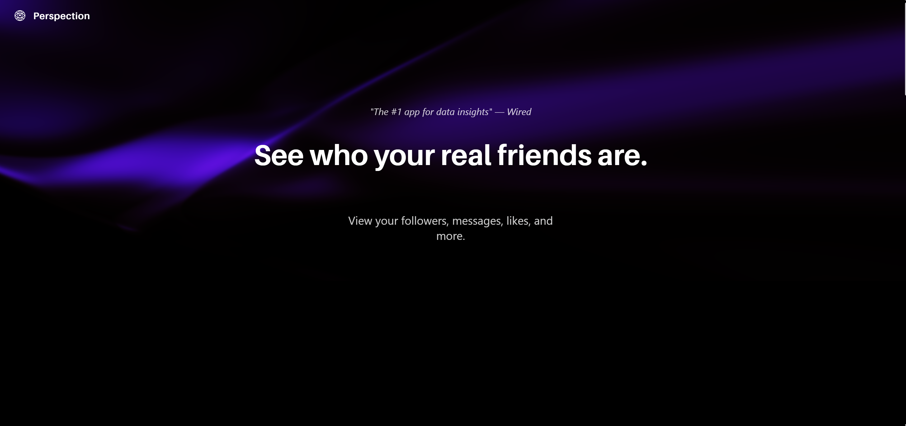
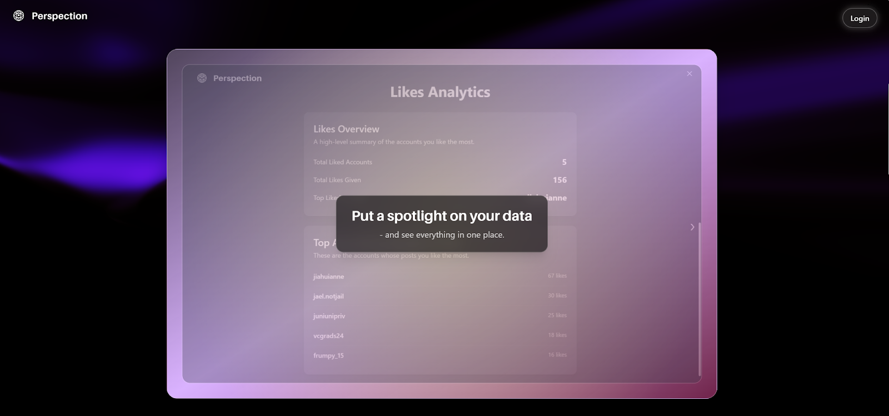
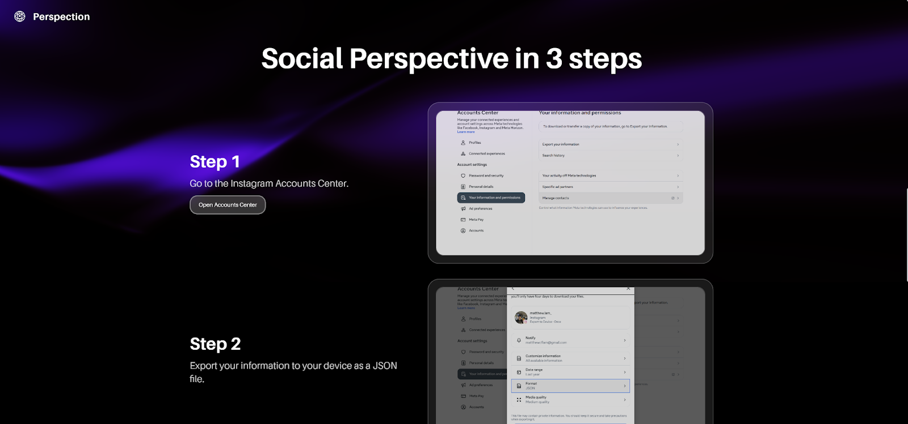
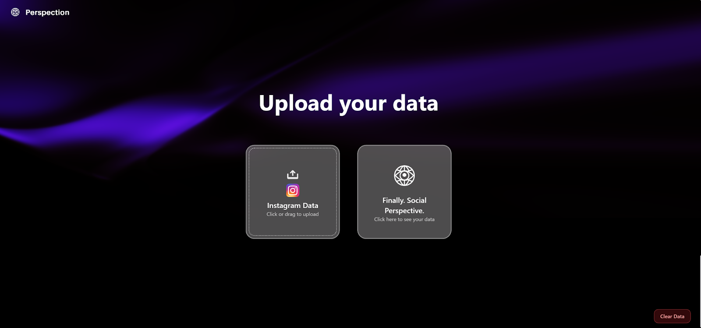
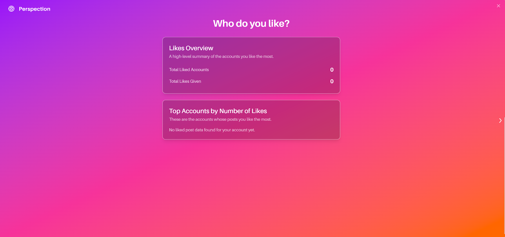

Perspection \- A social platform that can summarize select data from Instagram in a fun, social way, similar to Spotify Wrapped.

## Highlights
* See your total likes, who doesn’t follow you back, and the people you message the most  
* Responsibly secured data with login protection that can be permanently deleted by the user  
* Thoughtful and whimsical designs unique to each statistic are meant to be shared with friends

## Team Members
Matthew Lam  
Andreas Mendez-Cadrin  
Tony Chen  
Rui Chang  
Justin Qu

## Technologies
* JavaScript / HTML / CSS  
* TailwindCSS, ReactBits, PostgreSQL  
* Git / GitHub

## How It Works
The user uploads folders of JSON files exported from Instagram to the Frontend, which calls the Backend to process the data. Originally, it had a Python/Flask backend with JWT authentication and a PostgreSQL database that processed and stored user data on Google Cloud, but it has now been modified for frontend display purposes. The React frontend displays the analytics through interactive dashboards with visualizations showing top likers, message statistics, and follower relationships across multiple pages.

## Acknowledgements 
This project was developed as part of CPEN 221 at the University of British Columbia. The backend is no longer supported, but the website has been formatted so the frontend can be viewed by following the usage instructions below.

## Setup / Usage 
1\. Git Clone the repository    
2\. Open the folder in a code editor  
3\. Use these commands in the terminal to run a local host of the website  
```   
cd frontend  
cd analytics_board  
```  
and then use:  
```    
npm install    
npm run dev  
```  
4\. Follow the localhost link (something like [http://localhost:1234](http://localhost:1234)), directing to our website in your browser  
5\. Follow the instructions and upload your Instagram data. It is best to use all-time data to view accurate follower/following information.  
6\. See your stats and who your real friends are\!

## Images 



 

 
 